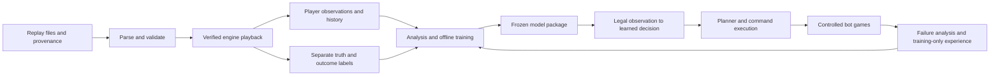

# Replay learning implementation plan

**22 September 2026 priority update:** use the
[AIIDE 2026 training and delivery plan](aiide-2026-training-plan.md) for the current
implementation order, CPU tournament deployment, pre-training gates, and October
14 submission schedule. The broader research roadmap below remains background.

Planning date: 19 September 2026. This is the primary development roadmap.
User decisions: prove the approach with Protoss, then extend to Terran and Zerg;
train on this PC first and estimate costs before considering cloud compute.
This document proposes work; extraction, model training, and game campaigns have
not been started by this planning task. The previously stopped campaign stays stopped.

Implementation update, 20 September: the [first macro model and training/runtime
contract](../training/README.md) are implemented, with synthetic tests and shadow-only
integration. Validated replay extraction, human-data training, learned control,
and strength evaluation remain outstanding. This is an initial feed-forward
baseline; recurrent beliefs and the broader roadmap below are future stages.

Training authorization update, 20 September: raw-replay command auditing and
Remastered backend probes have now started. Human-data training is still blocked
on the observation/label extraction requirements in the
[readiness report](replay-extraction-status.md). Command parsing is not a substitute
for those requirements.

## 1. Direction

Build a bot that learns decisions from strong human play and improves through
controlled games. Replace the current four-mode learner as the main learning
architecture. Retain useful observation, execution, diagnostics, and evaluation
infrastructure, and replace strategic rules module by module as evidence supports it.

The first useful learned bot should decide what to produce, when to expand,
and what hidden threats to expect. Later versions should learn where to scout,
when to commit armies, and how to control specialized units. End-to-end imitation
of every human click is outside the first release.

Replay imitation is a starting policy, not proof of strength. A replay shows
one action and its subsequent outcome; it does not establish what would have
happened after another action. Train from winners and losers, then measure the
resulting policy in the actual bot.



## 2. What the current repository tells us

| Finding | Consequence |
|---|---|
| `PolicyLearning.hpp` defines balanced, pressure, economy, and defend; `PolicyRuntime.cpp` uses coarse phase/worker/army/emergency/supply buckets and ordinarily chooses every 480 frames. | This representation cannot learn detailed production, spatial decisions, or scouting history. Preserve it as an experimental baseline, not the destination. |
| `train_policy.py` consumes this bot's reviewed `PolicyTrace.log` episodes. | It is not a human `.rep` importer. Build a separate replay dataset pipeline. |
| `ProtoddModule::onFrame` skips replays, and `BwapiBridge::observe` assumes a live self/enemy. | A dedicated extractor with an explicit player perspective is necessary. Loading a replay into the existing bot will not create training data. |
| `StrategicPlan`, `ProductionGoal`, and `MacroPlanner` already separate goals from resource allocation and execution. | They provide an integration boundary, after removing competing fixed goals from each learned scope. |
| The bot already logs macro actions, command acceptance, visibility, entity snapshots, incidents, and runtime timing. | Extend these records into feature and execution diagnostics; reuse the existing report/viewer. |
| The runtime is a Win32 DLL for StarCraft 1.16.1/BWAPI 4.4.0. | Verify replay-version compatibility and CPU inference early. A modern parser or Python model alone does not solve deployment. |
| `EXPERIMENT_STATUS.md` records unproven three-race learning and suspect historical results. | Preserve the outcome-validation rules and establish a new frozen baseline; old suspect wins are not evidence. |

### Dataset correction before training

The inspected catalogs contained **59,391 unique source match IDs**, of which
**5,366 records had a `proId` or `proName` tag**, and recorded MMR ranged from
2,000 to 2,809. These are catalog counts from an active download, not verified
downloaded, playable, or professional-game counts. Missing tags do not prove a
player is an amateur, and a tag does not certify both players. The saved summary
was behind the files being downloaded.

The downloader filters by MMR and duration, not verified professional identity.
Therefore track three distinct categories: confirmed professional perspectives,
other qualified ladder perspectives, and unknown quality. Validate which player
each source tag and rating describes. Build the pro subset through a versioned
account/alias mapping with evidence, including the opponent where available.
Do not quietly lower that standard to satisfy a quota. Expand acquisition if
10,000 confirmed pro games per matchup is still the collection requirement.

Six unordered matchups at 10,000 games each means approximately 60,000 unique
games. They can provide up to 120,000 player perspectives, but not 120,000
independent games. Protoss has up to 40,000 perspectives: 10,000 PvT, 10,000 PvZ,
and 20,000 from both sides of PvP. Quality and playback filters reduce these counts.
PvT comes from `TvP` and PvZ from `ZvP`; choose the Protoss player explicitly.

Audit the acquisition distribution before drawing strategy conclusions. Current
duration buckets omit games under 110 seconds, and collecting until a quota is
reached can favor particular date, MMR, and duration partitions. Report these
biases; acquire a supplemental short-game set for rush/abort analysis and separate
real short losses from disconnects. Keep late-game and unusual-strategy coverage.

## 3. Build an auditable replay pipeline

### A. Inventory and command parsing

Start while downloading continues. Process completed `.rep` files atomically;
never ingest `.part` files. Keep raw downloads unchanged. A manifest records:

- Source URL and match ID, file SHA-256, byte size, ingestion time, parser version.
- Actual replay format/version, game type, frame count, speed/time convention,
  both player slots/races, map-content hash, and map family/version.
- Player quality, rating source, identity confidence, date, and outcome evidence.
- Parse/playback/visibility/label validation status and explicit exclusion reason.
- Canonical game ID, duplicate group, split, extractor version, and artifact hashes.

Use a pinned version of [screp](https://github.com/icza/screp) as the first parser
candidate. Its documented support covers legacy and modern replay formats and
JSON output. Use it for headers, maps, and command streams; this is not a claim
that it reconstructs full state.

Deduplicate byte-identical files first, then copies of the same game saved by
different players using map, player slots, start metadata/seed when present, and
a validated command-stream fingerprint. Keep uncertain matches grouped until
reviewed. Both perspectives and every derived sample share the same split.

Winner labels need player-slot identity and corroborating evidence. `winnerRace`
cannot identify a winner in a mirror matchup. Quits, truncated recordings, and
disconnects can make outcomes ambiguous. Unknown outcome means no terminal-value
label; an otherwise validated prefix can still support imitation. Record the
valid-through frame and mask labels whose future horizon exceeds it.

### B. Playback compatibility experiment: the first technical gate

Parse an initial 120 games, 20 per matchup, sampled across formats, maps,
durations, and source qualities. Add compatible archived bot games as reference
fixtures. Compare these routes:

| Route | Intended role | Required evidence |
|---|---|---|
| Native StarCraft/BWAPI replay extractor | Reference state extraction for compatible replays | Correct player selection, event timing, resource/queue state, and visibility against known live traces. |
| OpenBW-based extractor | Candidate for faster automated extraction | Matching checkpoints against authoritative playback, including modern files and difficult units/mechanics. |
| Compatible modern playback/instrumentation | Research fallback for unsupported Remastered versions | Accurate state and perspective data with a reproducible interface; not assumed available. |
| Command parsing only | Inventory and limited action-sequence analysis | Clearly labeled command-only tier; no invented resources, fights, supply, or fog state. |

[OpenBW](https://github.com/OpenBW/openbw) is a candidate backend, not a guarantee
of compatibility. Its tracker contains [replay desynchronization reports](https://github.com/OpenBW/openbw/issues/27).
Do not equate successful file loading or reaching the last frame with accuracy.
Validate representative checkpoints at early, middle, and late stages: building
starts, units, ownership, resources, research, casualties, positions, and winner.

Then expand to 100 per matchup for throughput and coverage estimates. Publish a
matrix of format/map/mechanic support, validated fraction, seconds per replay,
peak memory, and compressed bytes per simulated minute. A supported extraction
route should pass at least 95% of its representative pilot; every admitted game
must pass per-game checks. Route failures to quarantine or another backend, and
report the resulting selection bias. These are proposed gates, not measured results.

If the modern corpus cannot be reproduced faithfully, continue parser-based
analysis, resolve the extractor, or acquire compatible replay subsets. Do not
train a state-conditioned policy from guessed states. The [STARDATA paper](https://arxiv.org/abs/1708.02139)
describes why full state reconstruction needs playback beyond reading replay commands.

### C. Player observations and labels

Produce two separate streams: **what a player could legally know at frame t**,
and **omniscient truth used only for targets and analysis**. Full state must never
be an alternative input path to a deployed policy.

Use explicit player-slot visibility, detection, exploration, and last-observed
memory. Do not rely on observer visibility or replay-mode `self()`. Enemy queues,
bank, unseen movement/deaths, unseen technology, and hidden transport contents
remain unavailable to input features. A visible enemy unit does not make all
its fields observable. Match the deployed adapter's field-level contract; BWAPI
documents these restrictions in its [Unit interface](https://github.com/bwapi/bwapi/blob/main/bwapi/include/BWAPI/Unit.h).

Do not let globally allocated replay unit IDs reveal how many unseen units exist.
Map first-observed entities to local IDs; store raw replay IDs only for joins and
label construction. Learn remembered information causally, including objects
seen empty, rather than updating memories from omniscient events.

Record every command and lifecycle event with its original frame. Initially
store macro observations every 24 frames plus decision events. Use frame counts
as the canonical clock and document conversion to game seconds and doubled BWAPI
supply. Extract 3-6-frame samples only for selected combat windows later.

Translate selection/hotkey command sequences into semantic requests. Link issue,
acceptance/queue change, actual start, completion, cancellation, and failure.
Discard redundant click spam from imitation targets, but retain it in the audit
stream. A build command is not proof a building was started. Align features to
the decision before the action's effects, accounting for command latency.

Initial macro labels represent accepted spending/production intent and duration,
not every mouse action or future surviving-unit counts. Model simultaneous
producer choices as a short ordered set with a stop token and updated resource
masks. Include genuine wait/save examples and cancelled or interrupted commitments
with explicit status. Label unsupported and ambiguous actions as unknown rather
than mapping them to the nearest convenient bot action.

### D. Storage and repeatability

Use a SQLite manifest for job state, compressed Parquet for events/observations/
labels, and memory-mapped or chunked tensors for training. Keep small human-readable
JSON summaries and HTML reports. Avoid full-frame JSON dumps for the whole corpus.
Separate `observations`, privileged `truth`, and `targets` directories and schemas.

Extraction is resumable and keyed by replay hash plus tool/schema versions.
Write outputs to temporary paths then atomically publish them. Record retries,
timeouts, desyncs, and field availability; a missing field is not a zero.
Fit normalization, vocabularies, clustering, and sampling weights on training data only.

## 4. What we will analyze and train

| Priority | Capability | Training target | Practical purpose and checks |
|---|---|---|---|
| 1 | Macro production and economy | Next accepted production/build/research/upgrade intents; worker/gas allocation targets; expansion timing and candidate base | Keep production active, avoid supply blocks, and adapt spending. Check top-k action prediction, timing error, illegal proposals, idle producers, bank, and completed economy milestones. |
| 1 | Opponent belief and threat prediction | Hidden unit/production counts, tech probabilities, expansion occupancy, and threat arrival within 15/30/60 seconds | React to likely threats before direct contact. Inputs remain legal observation history. Check count error, probability calibration, rare-threat recall, false alarms, and lead time. |
| 2 | Strategic transitions | Conditional composition/spending choices and medium-term objectives | Adapt after scouting, pressure, damage, or resource changes. Cluster opening families for analysis, but condition decisions on state rather than executing a fixed clock script. |
| 2 | Scouting | Next scout region/base and observed information-gathering behavior | Find expansions and technology without repeatedly losing scouts. Check destination ranking, information found, survival, and actual downstream performance. |
| 3 | Army commitment and positioning | Engage/hold/retreat/regroup decisions, target region, losses and objective changes over 5/10/20 seconds | Reduce bad fights and indecision. Evaluate detection, reinforcements, terrain, escape routes, and economy sacrificed while waiting. |
| 4 | Specialized micro | Targets, movement, spell position/timing, transport load/unload | Improve Storms, Reavers, Shuttles, focus fire, and retreats through dedicated scenarios; require finer extraction and supported execution. |
| Supporting | State value and failure diagnosis | Verified eventual result and bounded future economic/combat outcomes | Rank concerns and diagnose deterioration; observational value is not a counterfactual action evaluator. |

The macro report will show worker/supply curves, spending and bank, producer
utilization, first gas/tech/detection, expansions, upgrades, and army composition.
Compare at 3/5/8/12 minutes and at equivalent economic or tactical states. Show
quantiles, sample sizes, quality tiers, map, matchup, and opening family; one
average build order is not an appropriate target for every game.

For combat, segment encounters from local contact, attacks, damage, and movement,
including retreats and quiet hold situations. Track participating units and
reinforcements; score casualty value and objective/economic damage separately.
Infer strategic intent conservatively and attach label confidence. Audit ambiguous
engagements manually. Future losses define targets only, never pre-fight features
or participant selection that reveals future arrivals. A favorable trade is not
automatically a strategically good attack.

Extend the existing decision viewer with a perspective/omniscient toggle for
analysis, expert timeline, model probabilities, legal candidates, selected intent,
guardrail overrides, and actual execution. Keep omniscient analysis visibly labeled
and outside model inputs. Useful drilldowns include: "Why is detection late?",
"Why was this Nexus not built?", and "What did we know before this engagement?"

## 5. Model and training design

Start with simple baselines: matchup/phase action frequencies, nearest-neighbor
retrieval, a compact feed-forward model, and the current rules. This reveals data
or labeling problems before investing in a larger sequence model.

The main candidate is a compact recurrent network with shared Protoss features
and matchup-specific outputs. Start around 1-5 million parameters, with own
economy/queues/technology, visible and remembered enemies, observation ages, prior
intents, and base/region summaries. Use 60-120-second training windows plus memory
warm-up or saved recurrent prefixes so early scouting is not silently forgotten.
Benchmark separate matchup models as an ablation; share only if it helps.

Use an MLP or small GRU before adding a spatial encoder or attention over units.
Race-specific legal action masks and an explicit wait/continue action apply during
training and deployment. Separate structural legality from temporary affordability:
a valid savings goal can persist until executable. The executor still rejects
impossible immediate commands. Masks must depend solely on information available
at that decision time.

Losses: masked cross-entropy for categorical choices; multi-label losses for
concurrent goals; count/quantile losses for quantities and uncertainty; censored
time-to-event losses for expansion/tech timing; calibrated binary loss for threats
and verified game outcome. Normalize each head and choose weights on validation,
not test games. Report performance of each task rather than one blended loss.

Human quality weighting belongs to each acting player. Use both good wins and
good losses; winning does not make every action correct, and losses contain
valuable defense and recovery. Sample by game, matchup, phase, and quality; cap
dominance by one player, long games, repetitive commands, and common wait actions.
Report rare-event performance without distorting the natural test distribution.

Run this curriculum:

1. **Pipeline smoke test:** overfit a tiny known sample to check labels/masks;
   learn on roughly 1,000 validated Protoss perspectives and evaluate on held-out games.
2. **Imitation and prediction:** scale through roughly 10,000 perspectives to all
   eligible Protoss data, with learning curves and early stopping. Compare a small
   set of seeds and architectures, not a large blind hyperparameter search.
3. **Deployment distillation:** if a richer model helps, distill into a compact
   CPU model whose inputs remain legal. Compare exported and training outputs.
4. **Experience from the bot:** collect new training-only games, identify states
   absent in human data, and add reviewed corrections or scenario training.
5. **Reinforcement learning:** after stable execution, improve limited macro or
   tactical decisions against a pool of frozen bots and older checkpoints. Preserve
   imitation regularization, test for forgetting, and expand self-play only when
   measured throughput and opponent diversity support it.

Behavior cloning drifts when the bot reaches states experts did not visit; this
is a central motivation of [DAgger](https://arxiv.org/abs/1011.0686). We cannot
claim to run DAgger without an expert that supplies actions on those new states.
Human review, verified scenario solutions, and actual interaction are possible
sources; the bot's own guesses are not new expert labels.

Do not begin with unconstrained offline Q-learning over human actions. There is
no observed outcome for unchosen actions, action coverage is uneven, and the human
controller differs from ours. Likewise, replay playback alone cannot evaluate a
new policy: after our first different command the recorded continuation is not
the consequence of our action. Counterfactual tests require a validated interactive
simulator or fresh games. Exact replay-state branching is a later capability to
prove, not a prerequisite we assume exists.

## 6. Integration and what to replace

Proposed boundaries:

```text
Live adapter / replay perspective adapter
  -> shared ObservationEncoder and history
  -> LearnedBelief + LearnedMacroPolicy
  -> DecisionArbiter (learned scope or fallback, with explicit ownership)
  -> StrategicPlan / production intents
  -> MacroPlanner + workers + squads + navigation
  -> CommandBus + BWAPI
  -> proposal / selection / acceptance / completion telemetry
```

| Keep and extend | Replace or refactor when its learned replacement passes gates |
|---|---|
| Legal observation and memory; unit catalog and technology prerequisites | Coarse tabular state/action policy as the primary learner |
| Resource accounting, command validation/deduplication, worker assignment | Fixed strategic production ratios and economy/expansion thresholds |
| Placement, pathing, transport and spell execution | Hardcoded opening/transition selection and enemy-plan scoring |
| Runtime budgets, diagnostics, exact package snapshots, outcome validation | Hand-tuned fight thresholds and scout priorities, in later releases |

Learned control needs real authority. Do not merely add predictions to a plan
whose fixed goals always win. Give one owner to each scope, retain pending-intent
IDs, and explicitly cancel superseded reservations. Separate hard engine legality
from strategic preferences. Keep narrow safety interventions initially, log every
override and reason, and measure whether they prevent harm or defeat the model.

Roll out as shadow predictions, then learned macro only, learned beliefs only,
and the combination. Use feature flags to compare each against the frozen rules.
For model/schema failure, stale inference, invalid output, or a verified unfamiliar
state, use a deterministic fallback. Confidence thresholds must be calibrated on
held-out data; a confident model can still encounter unfamiliar states.

Training runs in 64-bit Python/PyTorch offline. Deploy a versioned CPU model in
the 32-bit C++ bot with no Python, network, or GPU requirement. First benchmark
a tiny dense model export using a bounded C++ evaluator. A compact GRU adds a
small, explicit operator set. Consider a packaged runtime only after proving its
Win32 build, dependencies, operator support, and latency; do not assume an ONNX
export is directly loadable in the tournament DLL.

Start macro/belief inference every 24-48 frames plus important observation events.
Provisional target: under 2 ms p99 added decision latency on the reference PC,
bounded allocations, and zero new runtime-limit violations in the full bot.
Measure whole-frame tails with concurrent managers. Later tactical models need
their own cadence and budget. Preserve deterministic action selection and reset
recurrent state between games.

Every model package includes weights, hashes, architecture/operator version,
feature and action schemas, normalization, dataset/split hashes, training config,
source commit, seed, validation report, and fallback policy version.

## 7. Validation that separates imitation from strength

Split games before generating windows. Use approximately 80% training, 10%
validation, and 10% final test, respecting time order within matchup and grouping
duplicates and both perspectives. Keep adjacent player sessions/series together
where identifiable. Report actual post-filter counts. Build additional, explicitly
disjoint challenge partitions for held-out map families and known player identities;
do not pretend a random game split tests unseen players or unseen maps.

Use validation for architectures, thresholds, and checkpoints. Lock the final
test until a candidate is selected. Repeated examination turns a test set into
development data; obtain a fresh holdout for subsequent major cycles. Keep human
replay test data and frozen bot evaluation traces out of all training.

Required gates:

- **Data:** deterministic extraction fixtures, no split overlap, no perspective
  leakage, audited action alignment, and a documented supported-version matrix.
  Audit at least 20 diverse games per initial Protoss matchup and 200 macro-event
  labels per matchup; target at least 98% correct semantic labels/timing within
  the declared tolerance. Fix systematic errors regardless of aggregate score.
- **Observation parity:** compare reconstructed observations with legal live traces
  from the same game on compatible fixtures. Perturb hidden-only truth while
  holding legal observations fixed; encoded features and policy outputs must stay
  unchanged. Verify unseen deaths, cloaking/detection, queues, and local IDs.
- **Offline:** improve on the strongest simple baseline for the intended head;
  report calibration, class/phase/matchup slices, rare threats, and confidence
  intervals clustered by game. High next-action accuracy alone is insufficient.
- **Runtime:** training/exported-model parity, valid masks and resource accounting,
  correct fallback, restart/state-reset tests, and the repository's verification
  and exact Release/Win32 package checks. Add tests for these contracts, not model
  weights or arbitrary trained probabilities.
- **Execution:** scenarios covering supply repair, lost builders/tech, gas changes,
  cloak threats, failed expansion placement, and recovery after army losses.
  Log recommendation, arbitration, command acceptance, realized start/completion,
  and delay/rejection cause as separate events.
- **Strength:** matched baseline/candidate batches by matchup, opponent package,
  map, spawn, settings, and learning-state snapshot. Requested equal seeds are
  not proof of identical games. Count crashes, timeouts, and incomplete games
  separately; only validated normal outcomes are strategic wins/losses.

Use a small smoke batch first, then plan at least 100 games **per important
matchup per arm** for an initial comparison, increasing the preregistered budget
when the expected improvement is small. At a 50% win rate, 100 independent games
have roughly a +/-10 percentage-point 95% interval, so this cannot establish a
small gain. Report a confidence interval for the candidate-minus-baseline change
using the schedule's pairing/clustering structure. Fix comparison checkpoints
in advance; repeated peeking is not evidence of significance.

Promotion requires a positive credible strength result at the predefined gate,
no material matchup regression under a predeclared non-inferiority margin, and
no new correctness/runtime failures. Choose the margin and sample budget before
running. An inconclusive result remains inconclusive. Freeze or snapshot opponent
learning data, model weights, opening learning, and binaries for each evaluation.

Bot reports should explain whether failure came from bad information, a bad
decision, a guardrail override, or bad execution. Compare workers, supply-block
time, bank conditional on intended savings, producer uptime, detection lead time,
expansion completion, casualties after commitment, and frame-time tails alongside
win rate. These diagnostics explain wins and losses; they do not replace them.

## 8. Local compute and storage plan

Observed machine: i5-13600KF, 14 cores / 20 logical processors; approximately
32 GB RAM; RTX 5070 Ti with 16,303 MiB VRAM reported by `nvidia-smi`. C: had about
503 GB free during inspection. This supports starting with compact models, but
extraction speed and training throughput still need measurement.

First verify the selected PyTorch/CUDA build with a real forward/backward step
on this GPU. Start extraction with two workers, then benchmark four and increase
only while memory, disk, and game-engine behavior stay healthy. Keep downloading
and interactive use in mind. Stream training batches from disk rather than loading
all perspectives and units into RAM.

Budget macro data first and dense combat windows selectively. As a scale reference,
[STARDATA](https://github.com/TorchCraft/StarData) reports 365 GB compressed for
65,646 games sampled at eight frames per second. Our storage must be measured
from our schema; that number is not a prediction for this pipeline.

After the pilot, estimate:

- Extraction wall time = games x measured mean playback time / measured effective
  concurrency, with startup, validation, and retry overhead included.
- Storage = simulated minutes x measured compressed bytes/minute for each tier,
  plus raw files, checkpoints, manifests, and a temporary-output margin.
- Training time = measured batches/epoch x seconds/batch x planned epochs/runs.

Example arithmetic only: 60,000 games averaging 20 minutes are 20,000 simulated
hours. At 50x playback and four workers with 70% parallel efficiency, extraction
would take about 143 wall-clock hours before extra overhead. Actual speed could
be very different; this is why extraction, not just GPU training, gets an early
benchmark. At one observation/second, 40,000 Protoss perspectives averaging
20 minutes would already contain 48 million observations before event samples.

No cloud is needed to begin. If measured local throughput becomes the limiting
factor, prepare a dated quote with GPU/CPU hours, storage, transfer, and a spending
cap before proposing a run. Buying GPU time will not solve a CPU playback or
replay-compatibility bottleneck.

## 9. Implementation sequence and deliverables

Effort ranges below are planning estimates for focused development, excluding
unattended extraction/evaluation and unpredictable engine-compatibility work.
Do not delay a pilot until every download completes.

| Milestone | Deliverable | Exit condition | Rough effort |
|---|---|---|---|
| M0: inventory and provenance | Manifest, quality audit, duplicate groups, split design, frozen baseline specification | Trustworthy counts and quality tiers; no claim that every collected game is pro | 1-2 days |
| M1: extraction feasibility | Parser adapter, explicit-perspective extractor prototype, 120-game then 600-game compatibility/throughput report | A validated playback route and measured resource budget; unsupported tiers documented | 3-7 days, longer if engine work is needed |
| M2: dataset and analysis | Observation/action contracts, golden fixtures, Parquet shards, macro/threat reports and viewer additions | Visibility/parity, label, split, and resume gates pass | 4-7 days |
| M3: first learned candidates | Baseline models, compact macro model, separate belief model, model cards and export | Held-out gains over baselines and working Win32 inference | 4-7 days |
| M4: playable Protoss | Shadow mode, separate-control ablations, frozen packages and controlled ladder results | Demonstrated strength improvement or a specific diagnosed failure for the next iteration | 4-7 days plus games |
| M5: scouting and tactics | Confidence-labeled encounters/scout decisions, scenario runner, bounded tactical models | Useful scenario performance followed by full-game improvement | Subsequent iteration |
| M6: experience-based improvement | Training-only bot experience, opponent pool, imitation-regularized RL where justified | Improvement without forgetting, exploitation, or runtime regression | Subsequent iteration |
| M7: other races | Shared data infrastructure, race-specific actions/executors/models | Terran then Zerg pass the same gates independently | After Protoss proof |

For Terran, account for add-ons, producer attachment, siege behavior, and repair.
For Zerg, model larva, paired units, worker-consuming construction, morphs, and
supply transitions explicitly. Sharing files and a neural encoder does not make
the current experimental controllers adequate executors.

### Proposed implementation locations

- `tools/replays/`: inventory, pinned parser adapter, manifests, deduplication,
  quality assignment, split creation, playback jobs, validation, and reports.
- `src/replay/`: dedicated replay module/backend and explicit perspective adapter.
- `include/protodd/ObservationEncoder.hpp` and `src/core/ObservationEncoder.cpp`:
  shared legal features, history, schema versioning, and offline encoder entry point.
- `training/`: configuration, dataset readers, baselines, macro/belief training,
  evaluation, export, and model cards; lock reproducible dependencies.
- `include/protodd/LearnedPolicy.hpp`, `src/core/LearnedPolicy.cpp`, and
  `src/bwapi/PolicyRuntime.*`: bounded inference and arbitration integration.
- `tests/`: small permitted replay references or synthetic fixtures, perspective
  parity, temporal/split leakage, action masks, export parity, and failure paths.
- `artifacts/replay-learning/<dataset-version>/` and `artifacts/models/<run-id>/`:
  ignored datasets/reports/checkpoints; commit schemas, configs, hashes, and summaries.

First implementation slice: create the inventory/quality report, select the
stratified pilot, pin the command parser, and prove one replay can yield audited
Protoss observations plus correctly aligned macro labels. Then prove that the
same features and a trivial exported predictor run inside the Win32 bot. These
two vertical slices retire the largest risks before a large training run.

## 10. Research used to inform the design

These sources support the approach, not a promise about our eventual strength:

- [Learning Macromanagement in StarCraft from Replays](https://arxiv.org/abs/1707.03743)
  demonstrates learning build decisions from human state/action data and integrating
  the network into a Brood War bot. It supports testing learned macro early.
- [A StarCraft Defogger](https://arxiv.org/abs/1812.00054) learns hidden/future state
  from partial histories and reports improvements when integrated into a rule-based
  bot. It supports a separate belief model as an early, testable intervention.
- [STARDATA](https://github.com/TorchCraft/StarData) provides extraction/dataset
  precedent and a storage-scale reference. Its older tooling/version requirements
  need validation before any reuse with this corpus.
- [DAgger](https://arxiv.org/abs/1011.0686) motivates collecting feedback on states
  induced by the learned policy, rather than assuming offline imitation generalizes.

The project-specific architecture, model sizes, thresholds, schedules, and effort
estimates above are proposed engineering choices to validate locally.
